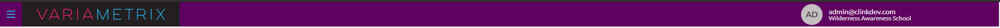
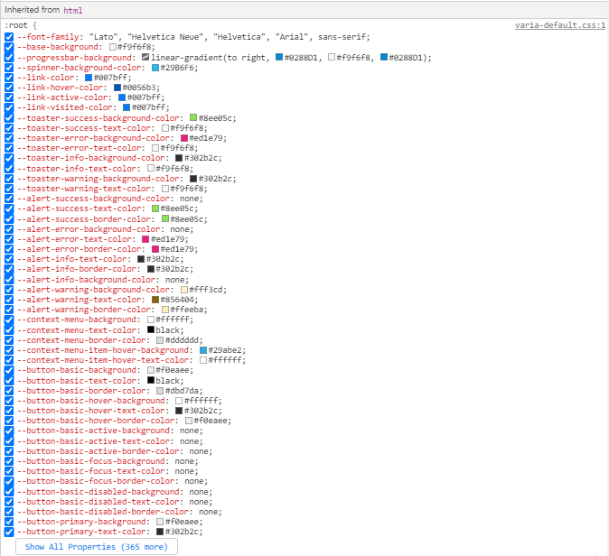

# White-Label
VariaMetrix is a professional dashboard development, expert-driven reporting insights, and creative ad design.

# Table of contents
- [Getting Started](#getting-started)
	- [package.varia.json Structure](#package.varia.json-structure)
  - [Styles](#styles)
  - [Assets](#assets)
  - [Installing package in VariaMetrix](#installing-package-in-variametrix)
- [Example](./example/EXAMPLE.md)
- [Testing Hint](#testing-hint)


# Getting Started 

## package.varia.json Structure

```json
{
    "name": "Sample Package name",
    "version": "1.0.1",
    "author": "VariaMetrix Devs <devs@variametrix.com> (https://variametrix.com)",
    "license": "MIT",
    "assets": [
      "asset-override/",
    ],
    "styles": [
      "css-override/"
    ],
    "components": [
      {
        "chartblock": [
          {
            "type": "color-pallete",
            "path": "components/chartblock/color-palette/color-palette.json"
          }
        ]
      }
    ]
}
```

<ul>
    <li>name - the name of the package.</li>
    <li>version - package version.</li>
    <li>author - author of the package</li>
    <li>license - license type of the package</li>
    <li>assets - containing path of assets to add in the package. See <a href="./example/EXAMPLE.md">Example</a> </li>
    <li>styles - An array of styles to add in varia metrix package. Package only supports plain CSS file. See <a href="./example/EXAMPLE.md">Example</a> </li>
    <li>components - containing a list of customizable components in VariaMetrix.</li>
</ul>

## Assets

Assets paths in css must be relative to your package.varia.json file and path must be prefixed with {{varia-url}}.

Ex.
```css
--navbar-primary-brand-background: url('{{varia-url}}assets/images/varia-logo-title.svg') center no-repeat;
```

Assets is supported by following format : .apng, .bmp, .gif, .ico, .cur, .jpg, .jpeg, .jfif, .pjp, .png, .svg, .tif, .tiff

## Styles

<a href="./package/css-verride/varia-default" ta>varia-default.css</a> this file contains all variables we use to theme VariaMetrix. Any variable not defined in package styles will revert to the VariaMetrix default.

Here's an example that changes the background color of navigation bar.

```CSS
  --navbar-background: #5f015f;
```



## Components

Currently in we only support changing the color palette of chartblock.


```JSON
{
    "colorPalette" : [
        "#321325",
        "#5F0F40",
        "#9A031E",
        "#CB793A",
        "#FCDC4D",
        "#1cc4ae"
    ]   
}
```
In code above, the first item in array gonna be the default value of chart block

## Installing package in VariaMetrix
<ol>
    <li>Clone the package folder</li>
    <li>Edit/Update styles and assets you want to change.</li>
    <li>Compress the files inside package folder, ensure `package.varia.json` is there</li>
    <li>Go to <a href="https://dashboard.variametrix.com/manage/white-label/package">Package page</a> and upload your compressed file</li>
</ol>

# Testing Hint
<p>To test the styles changes you've made in realtime, In variametrix site, Inspect site elements, In inherited from html section, you'll see all CSS variable we'
ve used in variametrix. You can alter that accordingly. </p>

